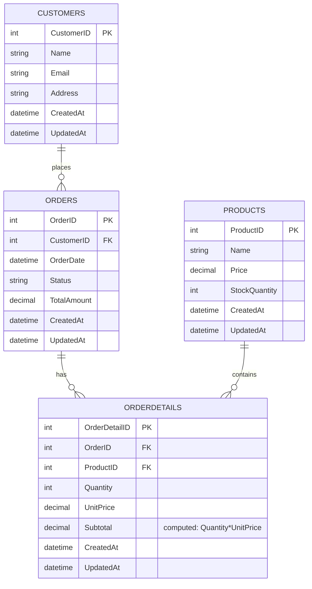

[](https://github.com/florasteve/online-store-database/actions/workflows/db-ci.yml)
# OnlineStoreDB

<p align="left">
  
  
  
</p>

**OnlineStoreDB** — Dockerized SQL Server demo with normalized schema (Customers, Products, Orders, OrderDetails), computed `Subtotal`, timestamps, procs for safe inserts & order lifecycle, analytics views, and seed data.

##  Quickstart
```bash
set +H
export SA_PASSWORD='YourStrong!Passw0rd'
docker compose -f docker/docker-compose.yml up -d
```
  > *then run the SQL in /sql (schema → procs → triggers → views → seed)*


##  Helpful Views  
`vwOrderSummary` — orders with line counts and totals  
`vwBestSellers30D` — top products by units & revenue (last 30 days)  
`vwOrderSummaryWithStatus` — includes order `Status`  
`vwLowStock` — products with low inventory  

##  Windows Scripts  
`scripts/dev-init.bat` — start container and run all SQL  
`scripts/dev-status.bat` — quick container/DB stats  
`scripts/report-low-stock.bat` — export low-stock CSV to `data/`  

## 🗺️ ER Diagram (Mermaid)


### Examples

**Category sales (30 days):**
```sql
SELECT TOP 10 CategoryName, Orders, Units, Revenue
FROM dbo.vwCategorySales30D
ORDER BY Revenue DESC;

```
**Close an order:**
```sql
[200~EXEC dbo.CloseOrder @OrderID = 42;
EXEC dbo.CloseOrder @OrderID = 42;

