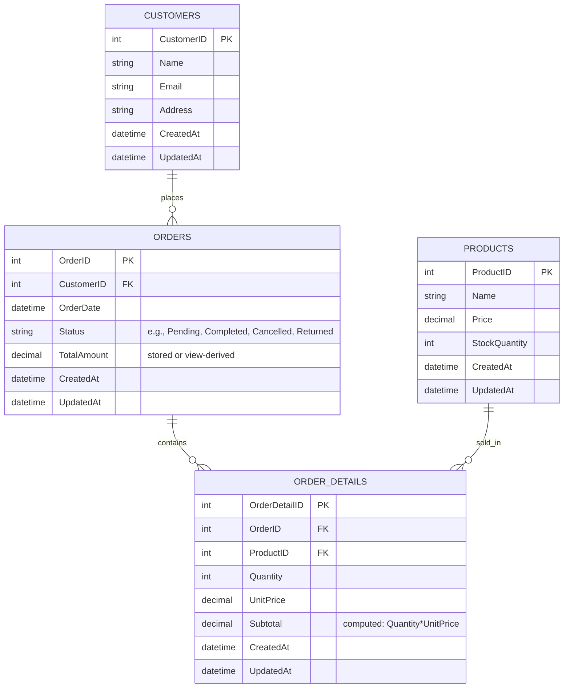

# Online Store Database

Relational database for **e-commerce operations and analytics**: customers, products, orders, and order line items.  
Built for **SQL Server** in **SSMS** with normalized tables, T-SQL procedures, computed subtotals, triggers (for UpdatedAt), and reporting views.

---

## ✨ Features
- Customer and product catalogs with basic indexing
- Orders with line items (computed `Subtotal = Quantity * UnitPrice`)
- Order total rollup and stock decrement on each added item
- Views for **order summaries** and **best-selling products (last 30 days)**
- Sample queries for last-month orders, revenue, top customers, and low stock

---

## 🧱 Schema (Core Tables)

- `Customers(CustomerID, Name, Email, Address, CreatedAt, UpdatedAt)`
- `Products(ProductID, Name, Price, StockQuantity, CreatedAt, UpdatedAt)`
- `Orders(OrderID, CustomerID, OrderDate, TotalAmount, CreatedAt, UpdatedAt)`
- `OrderDetails(OrderDetailID, OrderID, ProductID, Quantity, UnitPrice, Subtotal [PERSISTED], CreatedAt, UpdatedAt)`

**Relationships:**  
`Customers 1..* Orders` • `Orders 1..* OrderDetails` • `Products 1..* OrderDetails`

---

## 🧪 Quickstart (Docker)
```bash
set +H
export SA_PASSWORD='YourStrong!Passw0rd'
docker compose -f docker/docker-compose.yml up -d
# then run the SQL in /sql (schema, procs, triggers, views, seed)
```

---

## 🗺️ ER Diagram (Mermaid)

